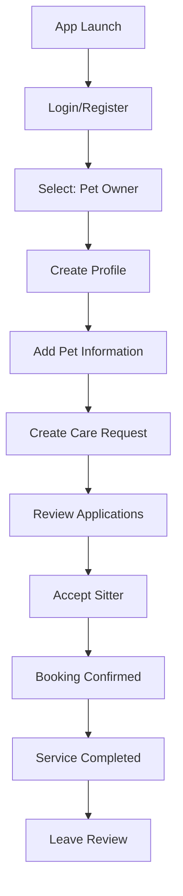
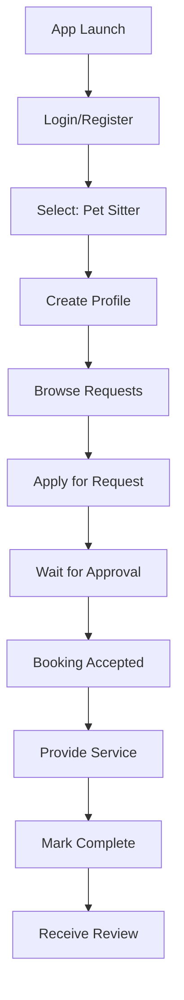

# PetSitter Connect 🐾

A comprehensive .NET MAUI mobile application that connects pet owners with trusted pet sitters for short-term pet care services (2-3 days). Built with .NET 9 and following modern MVVM architecture patterns.

## 📱 App Overview

PetSitter Connect is a marketplace platform that enables:
- **Pet Owners**: Find reliable pet sitters for their beloved pets
- **Pet Sitters**: Discover pet care opportunities and earn money
- **Secure Communication**: In-app messaging and booking management
- **Trust & Safety**: Rating and review system for both parties

## 🚀 Features

### ✅ **Implemented Features**

#### **Authentication & User Management**
- User registration with role selection (Pet Owner, Pet Sitter, or Both)
- Secure login with session management
- Profile management with location and preferences
- Password validation and security

#### **Pet Management**
- Add and manage multiple pets
- Detailed pet profiles (breed, age, medical conditions, special needs)
- Pet photos and care instructions
- Vaccination and medical history tracking

#### **Pet Care Request System**
- Create detailed care requests with dates, budget, and requirements
- Browse available requests with location-based filtering
- Search and filter by care type, dates, and budget
- Request status management (Open, In Progress, Completed)

#### **Booking & Scheduling System**
- Complete booking workflow (Pending → Confirmed → In Progress → Completed)
- Sitter application system for pet care requests
- Owner review and approval of applications
- Scheduling conflict detection and prevention
- Automated notifications and reminders

#### **Smart Notifications**
- Real-time booking status updates
- Application notifications for pet owners
- Reminder system for upcoming bookings
- Status change notifications (acceptance, rejection, completion)

#### **Role-Based Visual Indicators**
- Color-coded user role headers (Pet Owner: Green 🏠, Pet Sitter: Blue 🐕‍🦺)
- Dynamic role badges and context descriptions
- Smart tab titles and navigation based on user type
- Clear visual distinction between owner and sitter perspectives

#### **Role-Based Navigation System**
- Dynamic tab visibility based on user type
- Pet Owners see "🔍 Find Sitters" tab for creating requests
- Pet Sitters see "📋 Available Requests" tab for browsing opportunities
- Context-aware UI elements and action buttons
- Automatic navigation setup on login/registration

#### **In-App Chat System**
- Real-time messaging between pet owners and sitters
- Booking-based conversations with context
- Message read status and timestamps
- Role-based chat interface with visual indicators
- Conversation list with unread message counts

#### **Calendar Booking System**
- Visual calendar interface for date selection
- Role-based calendar views (Owner vs Sitter)
- Date range selection for booking creation
- Booking visualization with status indicators
- Monthly navigation with booking overview

### 🔄 **Planned Features**
- Rating and review system
- Payment integration with Stripe
- Advanced UI/UX enhancements
- Comprehensive testing suite

## 🏗️ Technical Architecture

### **Tech Stack**

| Component | Technology | Version |
|-----------|------------|---------|
| **Framework** | .NET MAUI | .NET 9 |
| **UI Pattern** | MVVM | CommunityToolkit.Mvvm |
| **Database** | SQLite | Entity Framework Core |
| **Authentication** | ASP.NET Core Identity | Identity Core |
| **Navigation** | Shell Navigation | Built-in MAUI Shell |
| **Data Binding** | Compiled Bindings | XAML + Converters |
| **Dependency Injection** | Built-in DI | Microsoft.Extensions.DI |

### **Project Structure**

```
PetSitterConnect/
├── Models/                 # Data models and entities
│   ├── User.cs            # User entity with Identity
│   ├── Pet.cs             # Pet information model
│   ├── PetCareRequest.cs  # Care request model
│   ├── Booking.cs         # Booking workflow model
│   ├── Review.cs          # Rating and review model
│   └── ChatMessage.cs     # Messaging model
├── Services/              # Business logic and data access
│   ├── IAuthService.cs    # Authentication interface
│   ├── AuthService.cs     # Authentication implementation
│   ├── IBookingService.cs # Booking management interface
│   ├── BookingService.cs  # Booking implementation
│   ├── ISchedulingService.cs # Scheduling logic interface
│   ├── SchedulingService.cs  # Conflict detection & availability
│   ├── INotificationService.cs # Notification interface
│   └── NotificationService.cs  # Notification implementation
├── ViewModels/            # MVVM ViewModels
│   ├── BaseViewModel.cs   # Base class with common functionality
│   ├── LoginViewModel.cs  # Authentication ViewModels
│   ├── RegisterViewModel.cs
│   ├── PetCareRequestListViewModel.cs # Request management
│   ├── CreatePetCareRequestViewModel.cs
│   ├── BookingListViewModel.cs # Booking management
│   └── BookingDetailViewModel.cs
├── Views/                 # XAML UI pages
│   ├── LoginPage.xaml     # Authentication pages
│   ├── RegisterPage.xaml
│   ├── PetCareRequestListPage.xaml # Request pages
│   ├── CreatePetCareRequestPage.xaml
│   ├── BookingListPage.xaml # Booking pages
│   └── BookingDetailPage.xaml
├── Converters/            # Value converters for data binding
│   ├── StringToBoolConverter.cs
│   ├── StatusToColorConverter.cs
│   └── BoolToTextConverter.cs
├── Data/                  # Database context and configuration
│   └── PetSitterDbContext.cs
└── Helpers/               # Utility classes and extensions
```

## 🔄 Application Workflow

### **User Journey - Pet Owner**



### **User Journey - Pet Sitter**



## 📱 Navigation Structure

### **Shell Navigation Hierarchy**

```
AppShell
├── Authentication Routes
│   ├── //login          → LoginPage
│   └── //register       → RegisterPage
└── Main Application (TabBar)
    ├── //main/home      → MainPage (Dashboard)
    ├── //main/requests  → PetCareRequestListPage
    └── //main/bookings  → BookingListPage

Modal Routes
├── createrequest        → CreatePetCareRequestPage
├── bookingdetails       → BookingDetailPage
├── requestdetails       → PetCareRequestDetailPage
└── requestapplications  → BookingApplicationsPage
```

### **Navigation Flow**

1. **App Startup** → Database initialization → Navigate to `//login`
2. **Successful Login** → Navigate to `//main` (TabBar with Home, Requests, Bookings)
3. **Create Request** → Modal navigation to `createrequest`
4. **View Booking** → Modal navigation to `bookingdetails/{BookingId}`
5. **Logout** → Navigate back to `//login`

### **Navigation Implementation**

The app uses MAUI Shell for navigation with the following key components:

**AppShell.xaml Configuration:**
```xml
<TabBar Route="main">
    <ShellContent Title="Home" ContentTemplate="{DataTemplate local:MainPage}" Route="home" />
    <ShellContent Title="Requests" ContentTemplate="{DataTemplate views:PetCareRequestListPage}" Route="requests" />
    <ShellContent Title="Bookings" ContentTemplate="{DataTemplate views:BookingListPage}" Route="bookings" />
</TabBar>
```

**Route Registration (AppShell.xaml.cs):**
```csharp
Routing.RegisterRoute("login", typeof(LoginPage));
Routing.RegisterRoute("register", typeof(RegisterPage));
Routing.RegisterRoute("createrequest", typeof(CreatePetCareRequestPage));
Routing.RegisterRoute("bookingdetails", typeof(BookingDetailPage));
```

**Navigation Commands in ViewModels:**
```csharp
[RelayCommand]
private async Task NavigateToDetailsAsync(int id)
{
    var parameters = new Dictionary<string, object> { { "BookingId", id } };
    await Shell.Current.GoToAsync("bookingdetails", parameters);
}
```

## 🗄️ Database Schema

### **Core Entities**

```sql
Users (ASP.NET Identity)
├── Id (Primary Key)
├── FirstName, LastName
├── Email, UserName
├── UserType (PetOwner/PetSitter/Both)
├── Location (Address, City, Latitude, Longitude)
├── Rating (AverageRating, TotalReviews)
└── Availability (IsAvailable, IsActive)

Pets
├── Id (Primary Key)
├── OwnerId (Foreign Key → Users)
├── Name, Type, Breed, Age
├── Medical Info (Conditions, Medications)
└── Care Instructions

PetCareRequests
├── Id (Primary Key)
├── OwnerId (Foreign Key → Users)
├── PetId (Foreign Key → Pets)
├── Title, Description
├── StartDate, EndDate, Budget
├── Location, CareType
└── Status (Open/InProgress/Completed)

Bookings
├── Id (Primary Key)
├── PetCareRequestId (Foreign Key)
├── SitterId (Foreign Key → Users)
├── OwnerId (Foreign Key → Users)
├── Status (Pending/Confirmed/InProgress/Completed)
├── TotalAmount, Notes
└── Timestamps (Created, Accepted, Completed)
```

## 🔧 Key Services Implementation

### **Authentication Service**
```csharp
public class AuthService : IAuthService
{
    private readonly UserManager<User> _userManager;

    public async Task<AuthResult> LoginAsync(LoginModel model)
    {
        var user = await _userManager.FindByEmailAsync(model.Email);
        var passwordValid = await _userManager.CheckPasswordAsync(user, model.Password);

        if (passwordValid)
        {
            Preferences.Set("CurrentUserId", user.Id); // Session management
            return new AuthResult { Success = true, User = user };
        }
        return new AuthResult { Success = false, Message = "Invalid credentials" };
    }
}
```
- **Session Management**: Uses `Preferences` for user session storage
- **Password Security**: ASP.NET Core Identity password hashing
- **Role Management**: Support for multiple user types (Owner/Sitter/Both)

### **Booking Service**
```csharp
public class BookingService : IBookingService
{
    public async Task<bool> AcceptBookingAsync(int bookingId)
    {
        var booking = await _context.Bookings.Include(b => b.PetCareRequest).FirstOrDefaultAsync(b => b.Id == bookingId);

        // Check for scheduling conflicts
        var canAccept = await _schedulingService.CanAcceptBookingAsync(booking.SitterId, bookingId);
        if (!canAccept) return false;

        booking.Status = BookingStatus.Confirmed;
        await _context.SaveChangesAsync();

        // Send notification
        await _notificationService.SendBookingAcceptedNotificationAsync(booking);
        return true;
    }
}
```
- **Workflow Management**: Complete booking state machine
- **Conflict Detection**: Prevents double-booking through scheduling service
- **Notification Integration**: Automatic notifications for status changes

### **Scheduling Service**
```csharp
public class SchedulingService : ISchedulingService
{
    public async Task<bool> IsAvailableAsync(string sitterId, DateTime startDate, DateTime endDate)
    {
        var conflictingBookings = await _context.Bookings
            .Where(b => b.SitterId == sitterId &&
                       (b.Status == BookingStatus.Confirmed || b.Status == BookingStatus.InProgress) &&
                       b.PetCareRequest.StartDate < endDate && b.PetCareRequest.EndDate > startDate)
            .ToListAsync();

        return !conflictingBookings.Any();
    }
}
```
- **Availability Checking**: Real-time conflict detection
- **Calendar Integration**: Track sitter availability and workload
- **Date Validation**: Prevent invalid booking scenarios

### **Notification Service**
```csharp
public class NotificationService : INotificationService
{
    public async Task SendBookingApplicationNotificationAsync(Booking booking)
    {
        var title = "New Booking Application";
        var message = $"{booking.Sitter?.FullName} has applied for your pet care request";

        await MainThread.InvokeOnMainThreadAsync(async () =>
        {
            await Application.Current?.MainPage?.DisplayAlert(title, message, "OK");
        });
    }
}
```
- **Real-time Alerts**: In-app notifications for booking updates
- **Scheduled Reminders**: Automated booking reminders
- **Cross-platform Support**: MAUI-compatible notification system

## 🚀 Getting Started

### **Prerequisites**
- Visual Studio 2022 (17.8+) or Visual Studio Code
- .NET 9 SDK
- MAUI workload installed

### **Installation**

1. **Clone the repository**
   ```bash
   git clone <repository-url>
   cd PetSitterConnect
   ```

2. **Restore dependencies**
   ```bash
   dotnet restore
   ```

3. **Build the project**
   ```bash
   dotnet build
   ```

4. **Run the application**
   ```bash
   # For Android
   dotnet run --framework net9.0-android
   
   # For iOS Simulator
   dotnet run --framework net9.0-ios
   
   # For macOS
   dotnet run --framework net9.0-maccatalyst
   ```

### **Database Setup**
The application automatically initializes the SQLite database on first run:
- Database file: `{AppDataDirectory}/petsitter.db`
- Auto-migration: Entity Framework handles schema creation
- Seed data: Default admin user created automatically

### **Default Credentials**
- **Email**: admin@petsitterconnect.com
- **Password**: Admin123!

### **Testing Role-Based Features**

1. **Login with admin credentials** (Pet Owner role):
   - **Observe**: Green header with 🏠 icon showing "PET OWNER"
   - **Tab titles**: "🔍 Find Sitters" and "📅 My Bookings"
   - **Context**: "Find trusted sitters for your pets"

2. **Test Pet Management**:
   - Navigate to "🔍 Find Sitters" → "Create Request"
   - **If pets exist**: Picker shows Buddy, Whiskers, Max
   - **If no pets**: "Add Your First Pet" button appears

3. **Test Pet Sitter Perspective**:
   - Register new account with UserType = PetSitter
   - **Observe**: Blue header with 🐕‍🦺 icon showing "PET SITTER"
   - **Context**: "Discover pet care opportunities"
   - Browse available requests with full pet details visible

4. **Test Calendar Booking System**:
   - **Navigate to Calendar tab** → See monthly calendar view
   - **Pet Owner**: Click dates to select booking range
   - **Pet Sitter**: Click dates to view existing bookings
   - **Calendar button** in requests page for quick access

## 🧪 Testing

### **Manual Testing Workflow**

1. **Registration Flow**
   - Register as Pet Owner
   - Register as Pet Sitter
   - Test profile creation

2. **Pet Management**
   - Add pet information
   - Edit pet details
   - View pet profiles

3. **Request Creation**
   - Create care request
   - Set dates and budget
   - Add special instructions

4. **Booking Workflow**
   - Apply for request (as sitter)
   - Review applications (as owner)
   - Accept/reject applications
   - Track booking status

## 🔮 Future Enhancements

### **Phase 2 Features**
- [ ] Real-time chat messaging
- [ ] Photo sharing during service
- [ ] GPS tracking for dog walking
- [ ] Emergency contact system

### **Phase 3 Features**
- [ ] Payment processing with Stripe
- [ ] Background check integration
- [ ] Insurance coverage options
- [ ] Multi-language support

### **Technical Improvements**
- [ ] Unit and integration tests
- [ ] Performance optimization
- [ ] Offline capability
- [ ] Push notifications
- [ ] Analytics integration

## 📄 License

This project is licensed under the MIT License - see the LICENSE file for details.

## 🤝 Contributing

1. Fork the repository
2. Create a feature branch
3. Commit your changes
4. Push to the branch
5. Create a Pull Request

## 📞 Support

For support and questions:
- Create an issue in the repository
- Contact the development team
- Check the documentation wiki

---

**Built with ❤️ using .NET MAUI and modern mobile development practices.**
